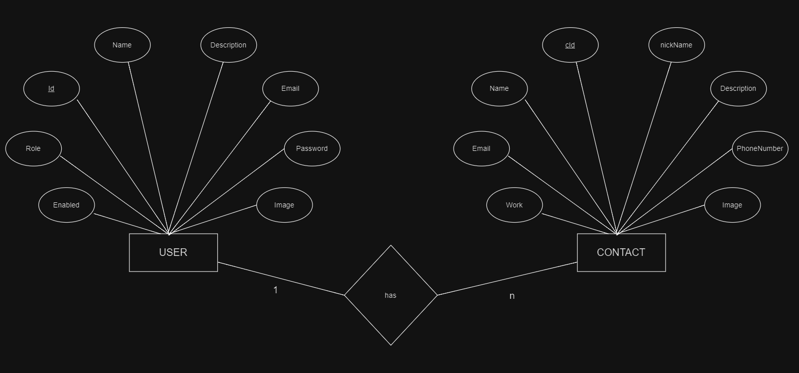

## Project: [ Smart Contact Manager ] (Spring Boot)

This project is a basic application built using Spring Boot. Additional technologies will be documented as they are integrated.

**Modules:**

* **User Management:**
    * User registration
    * User login
    * User logout

* **Contact Management:**
    * View contacts
    * Update contacts
    * Add contacts

**Dependencies Required:**

 *  * starter-web
    * starter-thymeleaf
    * starter-data-jpa
    * starter-security
    * spring-boot-devtools
    * mysql-connector-java
    * validation-api
    * hibernate-validator

**ER-Diagram**

                             